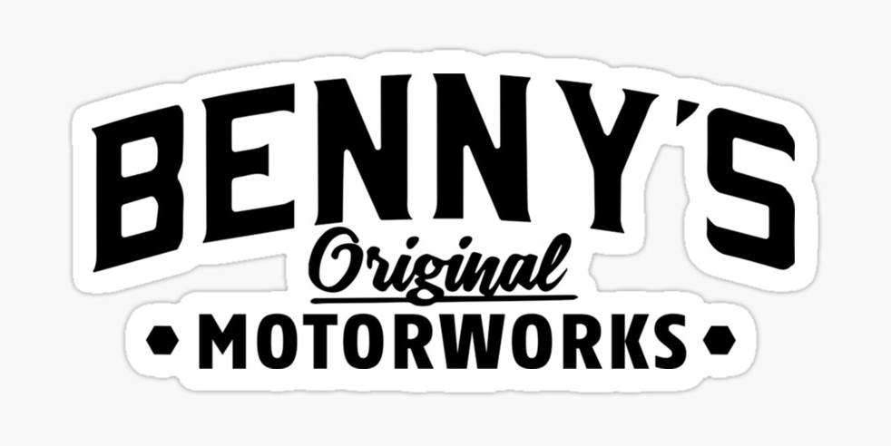

<html>
<head>
  <title>Benny's Original</title>
    
  
</head>
<body>
<body style="background-color:White;">
<body style="text-color:Red;">
	
  <h1>Performance Upgrade Sheet</h1>
  
  
  
  <h3> ENGINE </h3>
  
  

    <input type="checkbox" id="ColinChoice" value="1000">
    <label for="ColinChoice">Engine Level 1</label>
    <input type="number" value="1" min="1">
  

  
  

    <input type="checkbox" id="JudysChoice" value="3000">
    <label for="JudysChoice">Engine Level 2</label>
    <input type="number" value="1" min="1">
  

    <input type="checkbox" id="Velmachoice" value="8000">
    <label for="Velmachoice">Engine Level 3</label>
    <input type="number" value="1" min="1">
  

  
  <h3> SUSPENSION </h3>
  
  

    <input type="checkbox" id="Velmachoice" value="100">
    <label for="Velmachoice">Suspension Level 1</label>
    <input type="number" value="1" min="1">
  

  
  

    <input type="checkbox" id="Velmachoice" value="3000">
    <label for="Velmachoice">Suspension Level 2</label>
    <input type="number" value="1" min="1">
  

    

    <input type="checkbox" id="Velmachoice" value="5000">
    <label for="Velmachoice">Suspension Level 3</label>
    <input type="number" value="1" min="1">
  

  
  <h3> TRANSMISSION </h3>
  
  

    <input type="checkbox" id="Salad" value="1000">
    <label for="Salad">Transmission Level 1</label>
    <input type="number" value="1" min="1">
  

  
  

    <input type="checkbox" id="FruitExplosion" value="4000">
    <label for="FruitExplosion">Transmission Level 2</label>
    <input type="number" value="1" min="1">
  

  
  

    <input type="checkbox" id="TurkeySammie" value="7000">
    <label for="TurkeySammie">Transmission Level 3</label>
    <input type="number" value="1" min="1">
  

  
  <h3> BRAKES </h3>
  
   

    <input type="checkbox" id="BeefSammie" value="1000">
    <label for="BeefSammie">Brakes Level 1</label>
    <input type="number" value="1" min="1">
  

  
  

    <input type="checkbox" id="BLTSammie" value="5000">
    <label for="BLTSammie">Brakes Level 2</label>
    <input type="number" value="1" min="1">
  

  
  

    <input type="checkbox" id="choccypanckaes" value="8000">
    <label for="choccypanckaes">Brakes Level 3</label>
    <input type="number" value="1" min="1">
  

    <h3> TURBO </h3>
  
  

    <input type="checkbox" id="cat30" value="12000">
    <label for="cat30">D - A Class Vehicles</label>
    <input type="number" value="1" min="1">
  

  
   

    <input type="checkbox" id="cat50" value="15000">
    <label for="cat40">S Class Vehicles</label>
    <input type="number" value="1" min="1">
  

    <h3> REPAIR </h3>
  
  

    <input type="checkbox" id="cat30" value="1400">
    <label for="cat30">D - A Class Vehicles</label>
    <input type="number" value="1" min="1">
  

  
   

    <input type="checkbox" id="cat50" value="2400">
    <label for="cat40">S Class Vehicles</label>
    <input type="number" value="1" min="1">
  

  
  

    <label for="name">Employee's Name:</label>
    <input type="text" id="name">
  

 

  Total: $
  0.00

 
  
  
  

  

  
  

  <button class="calculate-button" onclick="calculateTotal()">Calculate Total</button>
  <button class="submit-button" onclick="submitOrder()">Submit Order</button>
  <button class="reset-button" onclick="resetCalculator()">Reset</button>
  
  
  

